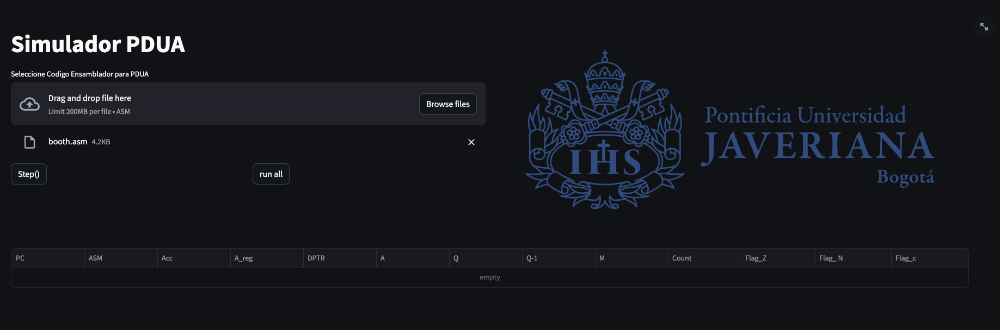
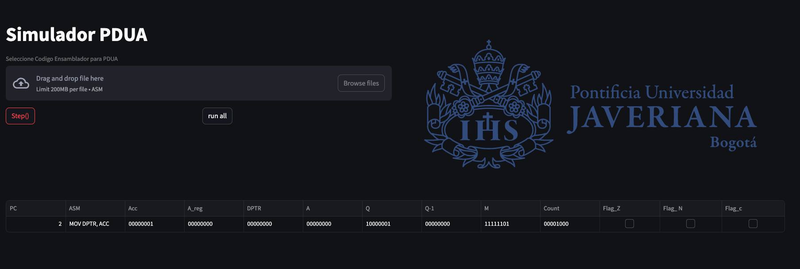
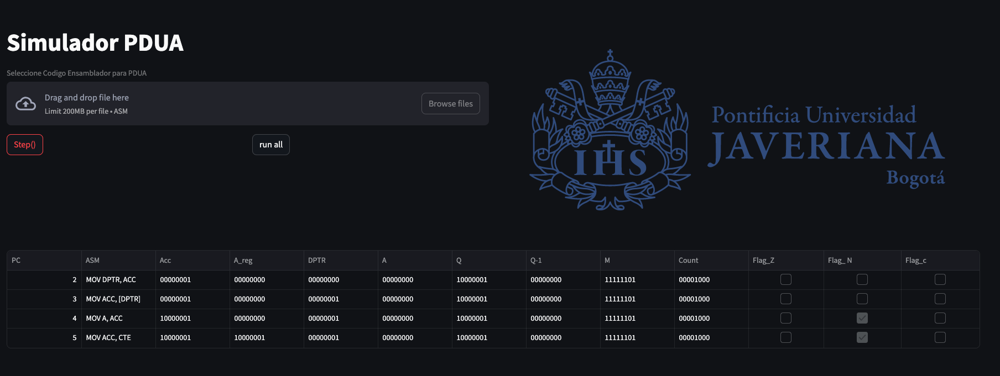
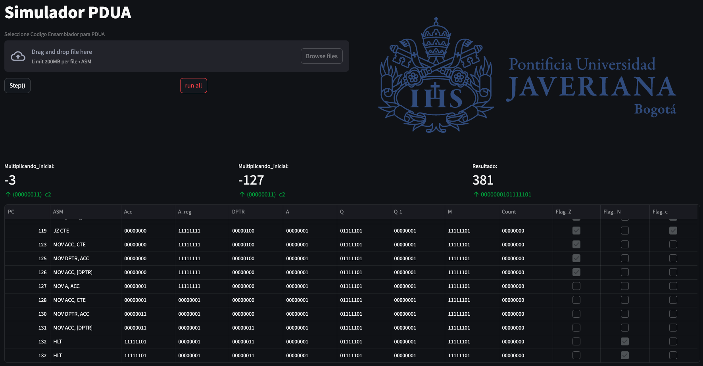

# PDUA_PUJ

Este repositorio contiene un simulador de una versión simplificada del procesador PDUA usado para clase de Arquitecura y Organización de computadores en la Pontificia Universidad Javeriana.

El simulador esta construido en python, cuenta con un compilador y está embebido en una pagina web que permite hacer seguimiento a la ejecución y resultado final.

La primer versión tiene como objetivo dar soporte a la ejecución del argoritmo de booth. por lo tanto la infomación que se muestra está ordenada, ubicada y desplegada bajo ese principio.

## Interfaz de usuario
El uso de la herramienta es simple, pues está embebido en un unico contenedor el cual da soporte a la interfaz web y al simulador que interpreta y simula el código del estudiante.

Para usar la herramienta se requiere la instalación de docker y docker-compose. Al clonar este repositorio lo unico que debe hacer es:

```bash
docker compose up -d
```
Este comando creará la imagen del contenedor y lo instanciará desplegando en el puerto 8501 la interfaz web, que se verá así:

Ahora se debe cargar el archivo <mark>.asm</mark> para reducir la capacidad de errores se dcrea un archivo <mark>booth_template.asm</mark> que contiene los minimos requeridos para que el archivo sea aceptado por el simulador. Una vez se cargue el archivo verá lo siguiente:

En la imagen se observan dos botones, a la izquierda "Step()" que le solicita al simulador realizar el siguiente ciclo fetch, es decir, ejecutar la siguiente intruccion. A continuación se observa que sucede al presionarlo.

En la parte inferior se observaba una tabla bacia, solo con los encabezados, al presionar el boton, se agrega el resultado de la ejecución. 

Al repetir varias veces el proceso se observa como aparecen nuevos registros que permiten dar seguimiento a la ejecución del código insertado.

El segundo boton al lado derecho "run all" pretende validar el comportamiento completo y registrando en la tabla el proceso realizado. Adicionalmente, expone cuales fueron los numeros ingresados para la multiplicacion, es decir, multiplicando y multiplicador. Tambien mostrando el resultado obtenido por la multiplicación. Para mayor entendimiento, la pagina traduce de ser necesario delcomplemento a dos los numeros negativos y lo indica.


Para evitar errores en ejecución, la pagina solo permite cargar un archivo a la vez y bloquea el boton de carga. Por lo tanto, si desea cargar un nuevo código debe refrescar la página.


## Set de Instrucciones
El set de instrucciones actual, contiene las instrucciones originales base y se agregaron 2 instrucciones complementarias RSH y LSH. Las cuales son un corrimiento ala derecha y a la izquierda respectivamente, como se observa estas ocupan dos posiciones de memoria, por lo que se realiza el corrimiento de la variable almacenada en ACC ese numero de veces, manteniendo un padding con cero. Existe una tercera instruccion para determinar que se llegó al fin del programa y es HLT. 

El resto de instrucciones corresponden a las definidas en el procesador PDUA.


```yaml
ISA:

  NOP: 0X00
  MOV ACC, A: 0X01
  MOV A, ACC: 0X02
  MOV ACC, CTE: 0X03
  MOV ACC, [DPTR]: 0X04
  MOV DPTR, ACC: 0X05
  MOV [DPTR], ACC: 0X06
  INV ACC : 0X07
  AND ACC, A : 0X08
  ADD ACC, A : 0X09
  JMP CTE : 0X0A
  JZ CTE: 0X0B
  JN CTE : 0X0C
  JC CTE : 0X0D
  CALL CTE: 0X0E
  RET: 0X0F
  RSH ACC CTE : 0x10 
  LSH ACC CTE : 0x11
  HLT : 0Xff
```

